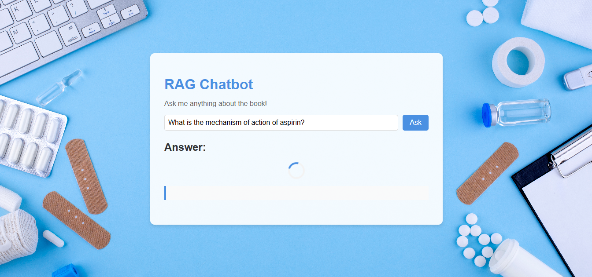

# RAG-based Chatbot with FastAPI, Pinecone, and Groq

This project is a Retrieval-Augmented Generation (RAG) based chatbot that allows users to ask questions about a PDF book (e.g., a basic & pharmacology textbook 12th Edition). The chatbot uses Pinecone for vector storage, Groq for language model inference, and FastAPI for the backend. The frontend is built with HTML, CSS, and JavaScript.

## Table of Contents
- [Features](#features)
- [Technologies Used](#technologies-used)
- [Setup and Installation](#setup-and-installation)
- [Usage](#usage)
- [API Endpoints](#api-endpoints)
- [Frontend](#frontend)
- [Contributing](#contributing)
- [License](#license)
- [Acknowledgments](#acknowledgments)

## Features
- **RAG-based Chatbot**: Combines retrieval and generation to provide accurate and context-aware answers.
- **PDF Book Integration**: Loads and processes a PDF book for question-answering.
- **Pinecone Vector Store**: Stores document embeddings for fast and efficient retrieval.
- **Groq LLM**: Uses Groq's language model for generating concise and accurate answers.
- **FastAPI Backend**: Provides a REST API for querying the chatbot.
- **Interactive Frontend**: A user-friendly web interface for interacting with the chatbot.

## Technologies Used
### Backend:
- **FastAPI**: Python web framework for building the API.
- **Pinecone**: Vector database for storing and retrieving document embeddings.
- **Groq**: Language model for generating answers.
- **LangChain**: Framework for building retrieval-augmented generation pipelines.

### Frontend:
- **HTML, CSS, JavaScript**: For building the interactive web interface.

### Other Tools:
- **HuggingFace Embeddings**: For generating document embeddings.
- **PyPDFLoader**: For loading and processing PDF documents.

## Setup and Installation
### Prerequisites
- Python 3.8 or higher
- Node.js (optional, for serving the frontend)
- API keys for Groq and Pinecone

### Steps
#### Clone the Repository:
```bash
git clone https://github.com/your-username/rag-chatbot.git
cd rag-chatbot
```

#### Set Up the Backend:
1. Create a `.env` file in the root directory and add your API keys:
```plaintext
GROQ_API_KEY=your-groq-api-key
PINECONE_API_KEY=your-pinecone-api-key
```
2. Install Python dependencies:
```bash
pip install -r requirements.txt
```
3. Run the FastAPI backend:
```bash
uvicorn backend.main:app --reload
```

#### Set Up the Frontend:
1. Serve the frontend using a simple HTTP server:
```bash
cd frontend
python -m http.server 8001
```
2. Open the frontend in your browser:
```
http://localhost:8001
```

## Usage

### Ask Questions:
1. Open the frontend in your browser.
2. Enter your question in the input box and click "Ask".

### View the Answer:
- The chatbot will display the answer along with relevant metadata (e.g., page number, chapter).

## API Endpoints
### `POST /query`
**Description**: Submit a query to the chatbot.

#### Request Body:
```json
{
  "query": "What is the mechanism of action of aspirin?"
}
```

#### Response:
```json
{
  "answer": "Aspirin works by inhibiting the enzyme cyclooxygenase (COX)...",
}
```

## Frontend
The frontend is a simple web interface built with HTML, CSS, and JavaScript. It allows users to:
- Enter questions.
- View answers.
- See loading spinners while waiting for responses.

### Features:
- **Responsive Design**: Works on both desktop and mobile devices.
- **Loading Spinner**: Displays a spinner while waiting for the backend response.
- **Clear Previous Answer**: Automatically clears the previous answer when a new question is asked.

# Screenshots

### Chatbot Interface

*Figure 1: The chatbot interface where users can ask questions.*


*Figure 2: The waiting cursor for until the response come from LLM*


*Figure 3: The final answer that come from LLM*

## Contributing
Contributions are welcome! If you'd like to contribute, please follow these steps:
1. Fork the repository.
2. Create a new branch for your feature or bug fix.
3. Commit your changes.
4. Submit a pull request.


## Acknowledgments
- **FastAPI** for the backend framework.
- **Pinecone** for the vector storage.
- **Groq** for the language model.
- **LangChain** for the RAG pipeline.

